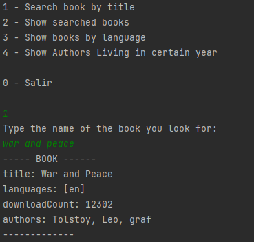
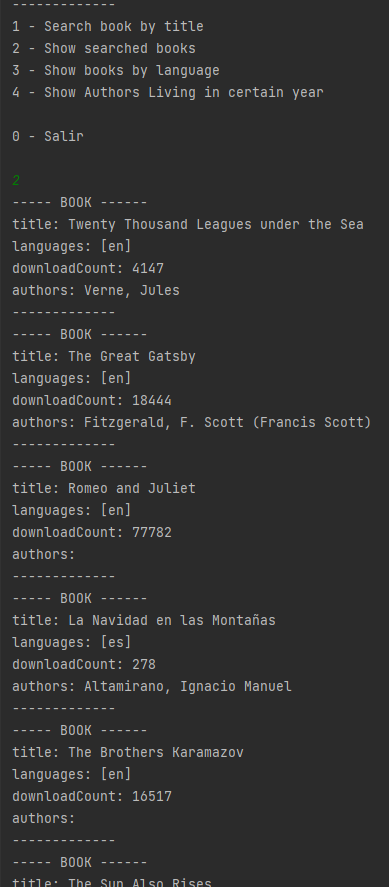
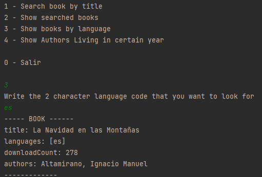
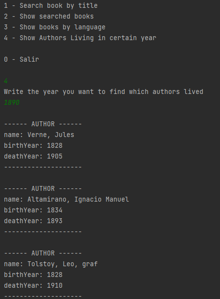

# Book and Author Management Application

This is a Java Spring Boot application that interacts with the [Gutendex API](https://gutendex.com/) to search for books and authors. It stores the retrieved data in a local PostgreSQL database, performs various queries using JPA derived queries and native SQL, and manages a well-defined data model with constraints.

## Features

- Fetches book and author information from the Gutendex API.
- Stores books, authors, and their relationships in a PostgreSQL database.
- Performs complex queries using JPA derived queries and native SQL.
- Enforces database constraints to maintain data integrity.
- Ensures uniqueness of authors based on their names.
- Ensures uniqueness of books based on their IDs.

## Requirements

- Java 8 or higher
- Spring Boot
- PostgreSQL database
- JPA (Java Persistence API)
- Gutendex API

## Database Schema

The application uses the following database schema:

CREATE TABLE book (
    id BIGINT PRIMARY KEY,
    title VARCHAR(255),
    download_count INT
);

CREATE TABLE author (
    id BIGSERIAL PRIMARY KEY,
    birth_year INT,
    death_year INT,
    name VARCHAR(255) UNIQUE
);

CREATE TABLE book_language (
    book_id BIGINT,
    language VARCHAR(255),
    PRIMARY KEY (book_id, language),
    FOREIGN KEY (book_id) REFERENCES book(id)
);

CREATE TABLE book_author (
    book_id BIGINT,
    author_id BIGINT,
    PRIMARY KEY (book_id, author_id),
    FOREIGN KEY (book_id) REFERENCES book(id),
    FOREIGN KEY (author_id) REFERENCES author(id)
);

## Images

Here are some screenshots of the application in action:

1. **Search for a book by name**  

2. **Show searched books stored in database**  

3. **Search books by language**  

4. **Search for authors that lived during a set year**  

